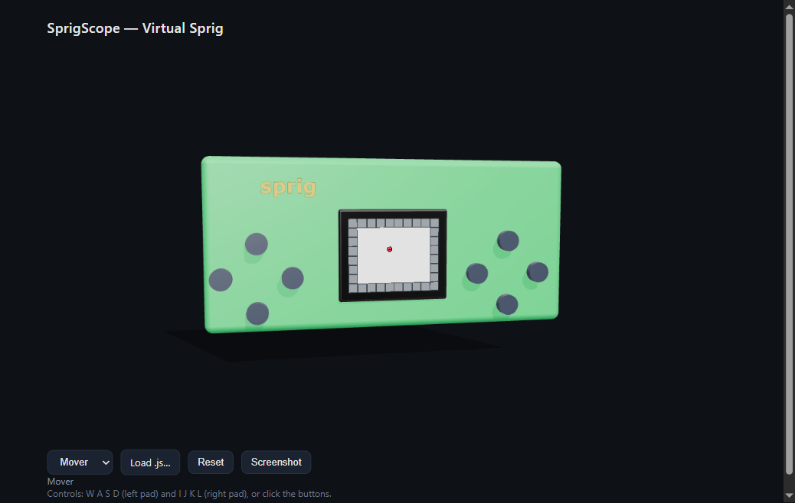

# SprigScope

A virtual [Sprig](https://sprig.hackclub.com/) on your computer — run and see Sprig games
without the hardware, and let an AI play them too.

**Live demo:** https://sprig-scope-mcp.vercel.app/

Sprig is Hack Club's open-source handheld game console (a Raspberry Pi Pico driving a
160×128 screen with two button pads). SprigScope reproduces it on the desktop:

- **Virtual Sprig (web app)** — a photo-real Sprig you play with the on-screen buttons or
  your keyboard, rendering the real 160×128 screen. In the spirit of the MakeCode micro:bit
  simulator.
- **MCP server** — exposes the screen and buttons to an AI (Claude, or any MCP client) so it
  can read the game state and play autonomously.
- **Core engine** — the shared, backend-agnostic device both of the above build on.



## Architecture

Everything sits behind one `SprigDevice` interface (160×128 framebuffer out, button input in):

- **Engine backend:** runs Sprig game JS via the official open-source `sprig` engine — fast, pixel-perfect, exposes symbolic state.
- **Chip backend:** an `rp2040js` hardware emulator that boots *any* RP2040 firmware/OS and renders its screen, exactly like real hardware.

The GUI and MCP server depend only on the interface, so either backend drops in without
touching them.

```
packages/core     shared device + the sprig-engine backend (TypeScript, tested)
packages/rp2040   the universal chip backend — boots any RP2040 firmware (rp2040js)
apps/web          the virtual Sprig (Vite + TypeScript)
apps/mcp          the MCP server (Node) — engine + chip backends
firmware/         bundled stock Sprig firmware (pico-os.uf2, MIT)
docs/             design spec + implementation plans
```

## Quick start

```bash
npm install

# Virtual Sprig in your browser:
npm run dev -w @sprigscope/web      # then open the printed localhost URL

# MCP server for AI control:
npm run build -w @sprigscope/mcp
node apps/mcp/dist/index.js         # speaks MCP over stdio — see apps/mcp/README.md

# Run all tests:
npm test
```

**Controls:** W A S D (left pad) and I J K L (right pad), or click the on-screen buttons.

## Status

- [x] Core engine backend — load game JS, 160×128 render with text, button input (tested)
- [x] **3D virtual Sprig web app** — the real `sprig.glb` model with the live screen + clickable buttons
- [x] MCP server — `get_screen`, `get_state`, `press_button`, `load_game`, `load_firmware`, `reset`, `get_status`
- [x] Universal chip backend (rp2040js) — boots & renders arbitrary RP2040 firmware/OS (`@sprigscope/rp2040`)
- [x] **Firmware in the 3D GUI** — "Boot stock OS" or load any `.uf2`; the emulator runs in a Web Worker
- [ ] Native desktop shell (Tauri) — wraps the web app unchanged; needs MSVC build tools

## Deploy

The web app is a static SPA hosted on **Vercel**. It's built locally and shipped as
prebuilt output, which keeps the deploy independent of the build server:

```bash
npm run deploy   # builds @sprigscope/web, then `vercel deploy --prebuilt --prod`
```

First-time setup: `npm i -g vercel`, `vercel login`, then `vercel link` to the project.

## Credits & license

Built on Hack Club's MIT-licensed [Sprig](https://github.com/hackclub/sprig) engine and
hardware design. SprigScope is released under the MIT License — see [LICENSE](LICENSE).
