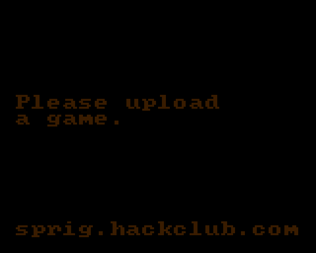

# @sprigscope/rp2040

The **universal** Sprig backend: a hardware-level RP2040 emulator (built on
[rp2040js](https://github.com/wokwi/rp2040js)) that boots **any** firmware image — the
stock Sprig OS *or your own custom firmware/OS* — and reconstructs the 160×128 ST7735
screen. It implements the same `SprigDevice` interface as the engine backend, so the
GUI and MCP server drive it identically.

## What it does

- **`loadFirmware(uf2)`** — boot an arbitrary RP2040 `.uf2` (the universal capability).
- `getFramebuffer()` / `pressButton()` / `reset()` — same `SprigDevice` surface as the engine backend.

To make real firmware run, it implements the RP2040 peripherals that rp2040js leaves
stubbed and the Sprig "Spade" firmware deadlocks on:

1. **XIP_SSI** → a SPI-NOR flash model, so the boot ROM's flash helpers (`do_flash_cmd`,
   `flash_get_unique_id`, …) complete instead of spinning.
2. **IO_QSPI** → a CS shim that frames flash transactions.
3. **SIO inter-core FIFO** → with a `multicore_launch_core1` handshake (rp2040js has no
   core1); the same FIFO is reused to inject button presses.

The bundled `firmware/pico-os.uf2` (Hack Club, MIT) is the stock firmware used by tests.

## Notes & caveats

- ~6 rendered FPS (single-threaded ARM interpreter) — fine for headless/AI use; the GUI
  would want a Web Worker.
- For Sprig **games**, prefer the engine backend (`@sprigscope/core`) — it's pixel-perfect,
  faster, and exposes symbolic state. This backend is for running **firmware**.
- The display is decoded live from the SPI stream (column-major RGB565, BGR); boot-screen
  text shows in the firmware's own (dim) palette.

Credits: rp2040js (Uri Shaked, MIT); Sprig firmware/engine (Hack Club, MIT).
